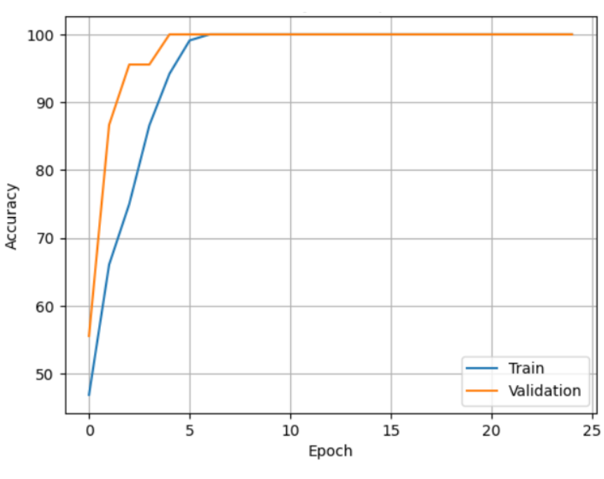
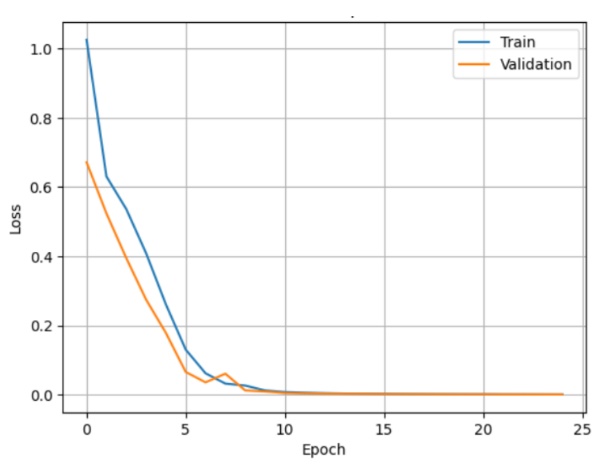

# Alzheimer's Disease Classification: 3D Attention Models & CNN Ensembles

This repository contains the code and methodology for classifying Alzheimer's Disease (AD) versus Cognitively Normal (CN) patients using Magnetic Resonance Imaging (MRI) data. 

The project explores complex deep learning architectures to process `.nii` medical imaging data, progressing from 2D pretrained baselines to sophisticated 3D Attention Mechanisms.

---

## 🧠 Data & Preprocessing

Working with volumetric MRI data requires specialized preprocessing. This project approaches the 3D data in two different ways depending on the model architecture:

* **2D Slice Extraction:** For the standard pretrained models, the 3D MRI volumes are sliced along the three anatomical planes (**axial, coronal, and sagittal**). The middle slices from each plane are extracted to capture the most significant structural information and fed into 2D CNNs.
* **Full Volumetric Processing:** For the advanced custom architectures (Ensemble and 3D DAM), the models process the complete 3D spatial context of the MRI scans to detect complex, multi-dimensional biomarkers of Alzheimer's.

*(Note: The raw `.nii` and `.nii.gz` dataset files are excluded from this repository due to GitHub's file size limits.)*

---

## 🏗️ Architectures Explored

This repository is split into three main modeling approaches:

### 1. Pretrained Baselines (`pretrained.py`)
Establishes baseline performance using standard 2D CNN architectures.
* Models evaluated: **AlexNet, ResNet18, and GoogLeNet**.
* These models utilize the 2D anatomical slices extracted during preprocessing.

### 2. DenseNet Ensemble (`ensemble.py`)
A custom ensemble architecture designed to extract deep features from MRI data.
* Utilizes a DenseNet-inspired backbone with dense blocks and transition layers.
* Designed to maximize feature reuse and alleviate the vanishing gradient problem common in deep medical imaging networks.

### 3. 3D Dual Attention Model (`3D_DAM.py`)
The flagship architecture of this project. A highly complex 3D Convolutional Neural Network designed to focus on the most critical regions of the brain.
* **Spatial Attention:** Teaches the network *where* to look by emphasizing informative spatial regions of the 3D scan.
* **Channel Attention:** Teaches the network *what* to look for by weighting the most important feature channels.

---

## ⚙️ Installation & Usage

1. **Clone the repository:**
   ```bash
   git clone [https://github.com/](https://github.com/)[YourUsername]/alzheimers-3D-classification.git
   cd alzheimers-3D-classification
   ```

2. **Install dependencies:**
   Ensure you have Python installed, then install the required libraries (including PyTorch and NiBabel):
   ```bash
   pip install -r requirements.txt
   ```

3. **Running the models:**
   Place your dataset inside a `split/` directory at the root level, then execute the desired script:
   ```bash
   python 3D_DAM.py
   ```

---

## 📊 Results & Known Limitations

Building 3D convolutional models for medical imaging involves handling massive parameter counts. While the custom architectures successfully compile, extract features, and process the full 3D spatial context, the current training iterations demonstrate a classic deep learning challenge: **overfitting**.

### Model Training Analysis
Below are the training vs. validation curves for the 3D Dual Attention Model (DAM):

<table>
  <tr>
    <td align="center"><b>DAM Accuracy</b></td>
    <td align="center"><b>DAM Loss</b></td>
  </tr>
  <tr>
    <td></td>
    <td></td>
  </tr>
</table>

*(You can also view the Ensemble and ResNet18 performance graphs in the `results/` directory).*

**Observations:**
As seen in the graphs above, the training loss decreases steadily and training accuracy climbs, but the validation curves diverge and stagnate. This indicates that while the model has the capacity to learn the structural features of the brain, it is currently memorizing the limited dataset rather than generalizing to unseen MRI scans.

**Future Work & Improvements:**
To bridge the gap between training and validation performance in future iterations, the following steps are required:
* **Heavy 3D Data Augmentation:** Implementing random 3D rotations, cropping, and elastic deformations to artificially expand the dataset and prevent memorization.
* **Aggressive Regularization:** Increasing dropout rates within the DenseBlocks and Attention modules, and implementing early stopping.
* **Cross-Validation:** Utilizing Stratified K-Fold Cross Validation to ensure a perfectly balanced distribution of AD and CN classes across splits, mitigating potential data leakage.
